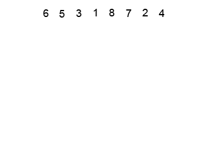

# 🖼️ Sorting Algorithms — Visual Gallery

Below are short visual demos of common sorting algorithms.

## Bubble Sort
<<<<<<< HEAD
[  ]
=======
  
>>>>>>> 6845df054cca112b74c6917efa22b869698d7455
Repeatedly swap adjacent out-of-order elements until the array is sorted.

---

## Selection Sort
<<<<<<< HEAD
[![Selection Sort (assets/sorting-gifs/selection.gif)  ]
=======
  
>>>>>>> 6845df054cca112b74c6917efa22b869698d7455
Select the minimum from the unsorted part and place it at the start.

---

## Insertion Sort
<<<<<<< HEAD
[![Insertion Sort (assets/sorting-gifs/insertion.gif)  ]
=======
  
>>>>>>> 6845df054cca112b74c6917efa22b869698d7455
Build the sorted portion by inserting each element into its correct spot.

---

## Merge Sort
<<<<<<< HEAD
[![Merge Sort (assets/sorting-gifs/merge.gif)  ]
=======
  
>>>>>>> 6845df054cca112b74c6917efa22b869698d7455
Divide the array, sort subarrays, and merge them back together.

---

## Quick Sort
<<<<<<< HEAD
[![Quick Sort (assets/sorting-gifs/quick.gif)  ]
=======
  
>>>>>>> 6845df054cca112b74c6917efa22b869698d7455
Partition around a pivot, then recursively sort left/right parts.

---

## Heap Sort
<<<<<<< HEAD
[![Heap Sort (assets/sorting-gifs/heap.gif)  ]
Build a max heap, then repeatedly extract the maximum element and heapify the remainder.
=======
  
Build a max heap, then repeatedly extract the maximum element and heapify the remainder.
>>>>>>> 6845df054cca112b74c6917efa22b869698d7455
