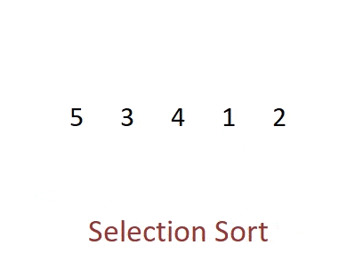
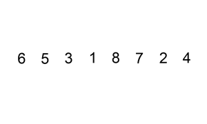
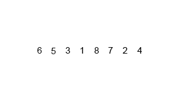

# 🖼️ Sorting Algorithms — Visual Gallery

Below are short visual demos of common sorting algorithms.

## Bubble Sort

Repeatedly swap adjacent out-of-order elements until the array is sorted.

---

## Selection Sort

Select the minimum from the unsorted part and place it at the start.

---

## Insertion Sort

Build the sorted portion by inserting each element into its correct spot.

---

## Merge Sort

Divide the array, sort subarrays, and merge them back together.

---

## Quick Sort

Partition around a pivot, then recursively sort left/right parts.

---

## Heap Sort
![Heap Sort] (assets/sorting-gifs/heap.gif)  
Build a max heap, then repeatedly extract the maximum element and heapify the remainder.